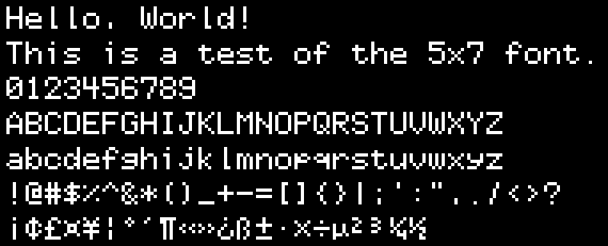

# Font5x7 for Pillow (PIL)

A simple bitmap font for Pillow (PIL), designed for small displays such as OLEDs, LCDs, and LED matrices.



## Features

- Characters: A–Z, a–z, 0–9, common punctuation, and some Latin-1 symbols
- Grid size: 5×7 pixels per character
- Format: PIL bitmap font (`.pil` / `.pbm`)

## Requirements

- Python 3.x
- [Pillow](https://pypi.org/project/Pillow/)

```bash
pip install pillow
```

## Usage

1. Copy `fonts/font5x7.pil` and `fonts/font5x7.pbm` into your project directory.
2. Load the font with Pillow:

```python
from PIL import Image, ImageDraw, ImageFont

font = ImageFont.load("font5x7.pil")  # Adjust the path as needed
img = Image.new("1", (128, 64))
draw = ImageDraw.Draw(img)
draw.text((10, 10), "Hello, World!", font=font, fill=1)
img.show()
```

See also the [example script](scripts/render_example_image.py).

## Customization

### Modifying the Font Design

1. Edit `src/font5x7_src.png` to change the character designs (white pixels represent the glyphs).
2. Regenerate the font files:

   ```bash
   python scripts/generate_font.py
   ```

3. The updated files will be written to `fonts/font5x7.pil` and `fonts/font5x7.pbm`.

**Layout:** `src/font5x7_src.png` contains 256 character cells arranged in a 16-column × 16-row grid, in ASCII code order (`code = row × 16 + col`). Each cell is 5×7 pixels with a 1-pixel gap between adjacent cells, and the grid starts at a 1-pixel offset from the top-left corner of the image.

### Adding New Characters

1. Draw new glyphs in the appropriate cells of `src/font5x7_src.png` (see layout above).
2. Add the code points to the `SUPPORTED_CHARACTERS` list in `scripts/generate_font.py`.
3. Regenerate the font files (see command above).

## License

Released under the [MIT License](LICENSE).
